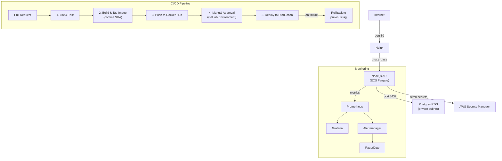

# BT-DevOps

Production-grade DevOps setup for a containerized fintech API — Dockerized Node.js service, GitHub Actions CI/CD, Terraform on AWS, and a monitoring stack.

---

## Local Setup

**Prerequisites:** Docker, Docker Compose

```bash
cp .env.example .env        # fill in your values
docker compose up --build   # starts app + Postgres + Nginx
curl http://localhost/health # should return {"status":"ok"}
```

---

## Architecture



---

## CI/CD Pipeline Stages

| Stage | Trigger | What it does |
|-------|---------|-------------|
| Lint & Test | Every PR | Runs `eslint` + `jest` — blocks merge on failure |
| Build & Push | Merge to `main` | Builds Docker image tagged with short commit SHA, pushes to Docker Hub |
| Manual Approval | After push | Requires a human reviewer in GitHub Environments before prod deploy |
| Deploy | After approval | SSH into prod server, pulls new image, restarts container |
| Rollback | Deploy failure | Automatically redeploys the previous SHA tag |

---

## Folder Structure

```
BT-DevOps/
├── app/                    # Node.js health-check API
│   ├── server.js
│   ├── server.test.js
│   ├── package.json
│   └── Dockerfile          # multi-stage build
├── nginx/
│   └── default.conf        # reverse proxy config
├── terraform/
│   ├── main.tf             # root module wiring
│   ├── variables.tf
│   ├── outputs.tf
│   └── modules/
│       ├── vpc/            # VPC, subnets, IGW, NAT
│       ├── ecs/            # Fargate cluster, ALB, auto-scaling
│       ├── rds/            # Postgres in private subnet
│       └── iam/            # least-privilege roles
├── monitoring/
│   ├── prometheus.yml      # scrape config
│   └── alerts.yml          # USSD-specific alert rules
├── scripts/
│   ├── rollback.sh         # manual rollback helper
│   └── load-test.js        # k6 salary-date spike test
├── case-study/
│   └── afripay-answers.md  # AfriPay DevOps strategy
├── .github/workflows/
│   └── ci-cd.yml           # full pipeline
├── docker-compose.yml
└── .env.example
```

---

## Assumptions

- AWS is the target cloud provider
- Docker Hub is used as the container registry (swap `DOCKERHUB_USERNAME` secret for ECR if preferred)
- Production server has Docker + Docker Compose installed and is reachable via SSH
- GitHub Environments are configured with required reviewers for the `production` environment

## One Thing to Improve With More Time

Add **HTTPS/TLS termination** at the Nginx layer using Let's Encrypt (Certbot) or an AWS ACM certificate on the ALB. Currently traffic between the internet and Nginx is plain HTTP — acceptable for a demo, not for a live fintech product handling payment data.
